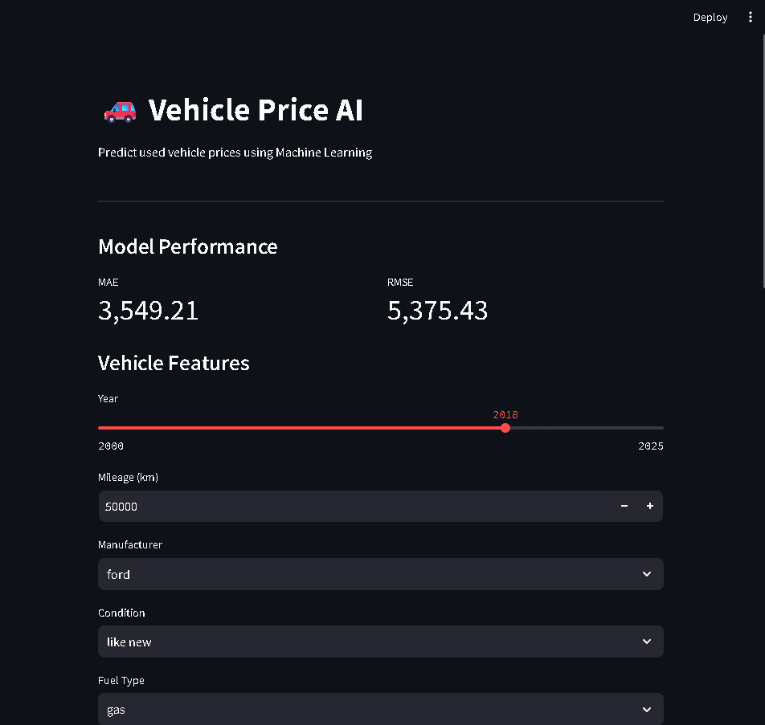
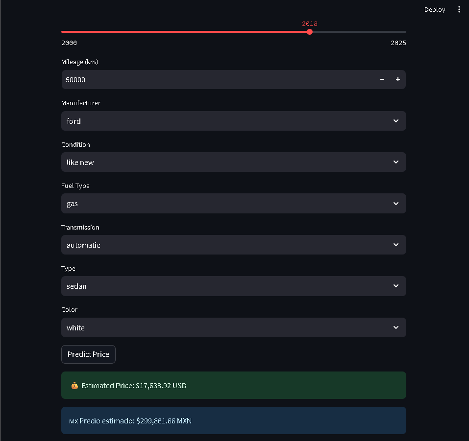
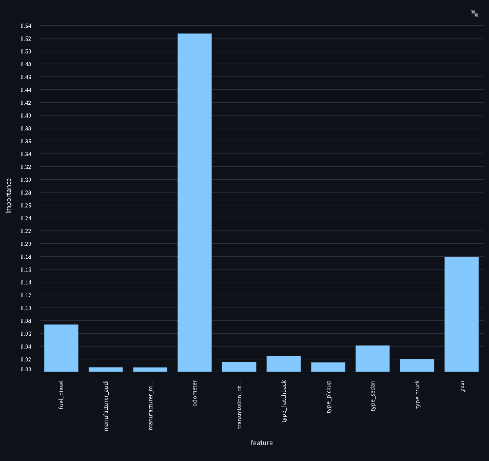
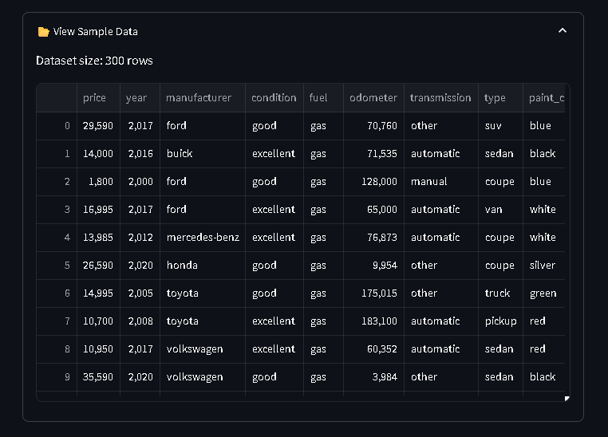

# 🚗 Vehicle Price AI

Machine Learning web application to predict used vehicle prices based on structured data.

🔗 **Live Demo:** https://vehicle-price-ai.onrender.com  
📂 **Repository:** https://github.com/camargoluisenrique/vehicle-price-ai  

---

## 📌 Overview

This project builds an end-to-end Machine Learning system capable of predicting vehicle prices using real-world data.

It includes:

- Data preprocessing pipeline
- Model training and evaluation
- Feature importance analysis
- Interactive web interface (Streamlit)
- Cloud deployment (Render)

---

## 🚀 Features

- 💰 Price prediction in real time  
- 📊 Model performance metrics (MAE, RMSE)  
- 🧠 Feature importance visualization  
- 📦 Optimized dataset preview  
- 🌎 Public deployment (Render)  
- 💱 USD → MXN conversion  

---

## 📊 Model Performance

| Metric | Value |
|------|------|
| MAE | 3,549 |
| RMSE | 5,375 |

---

## 📸 Application Preview









---

## 🧠 Machine Learning Pipeline

1. Data Cleaning (missing values, filtering)
2. Feature Engineering
3. Categorical Encoding (OneHotEncoder)
4. Model Training (Random Forest Regressor)
5. Evaluation (MAE, RMSE)
6. Deployment (Streamlit + Docker + Render)

---

## 📂 Dataset

- Source: Kaggle (used vehicles dataset)
- Cleaned dataset: `clean_data.csv`
- Sample dataset: `sample_data.csv` (for lightweight UI preview)

---

## 🚀 Business Impact

This model can be used by:

- Car marketplaces  
- Dealerships  
- Buyers to estimate fair prices  

✔️ Reduces pricing uncertainty  
✔️ Improves decision-making  
✔️ Enables automated valuation systems  

---

## 🎯 Final Result

- Predicts vehicle prices in real time  
- Handles structured data inputs  
- Provides model interpretability (feature importance)  
- Fully deployed and accessible via web  

---

## 🛠️ Tech Stack

- Python
- Pandas / NumPy
- Scikit-learn
- Streamlit
- Docker
- Render (deployment)

---

## ⚙️ Run Locally

```bash
git clone https://github.com/camargoluisenrique/vehicle-price-ai.git
cd vehicle-price-ai

python -m venv venv
venv\Scripts\activate

pip install -r requirements.txt

streamlit run app.py
```

---

👤 Author

Luis Enrique Camargo    |   
Data Scientist | Machine Learning Engineer
