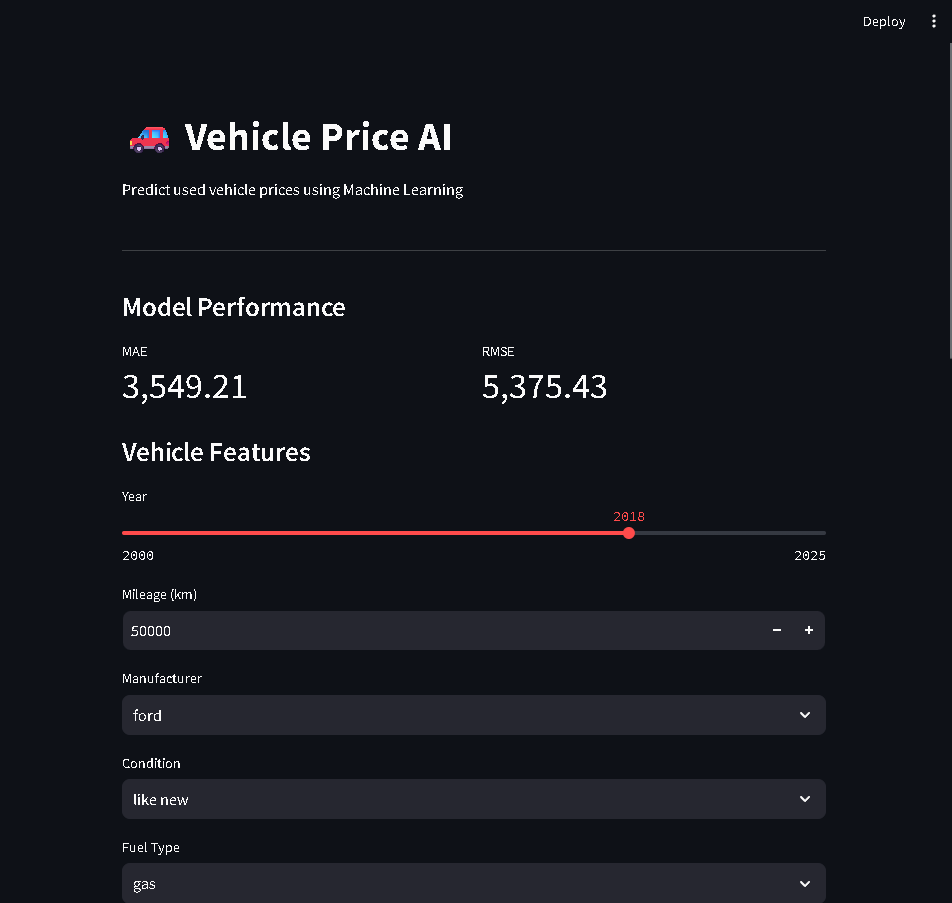
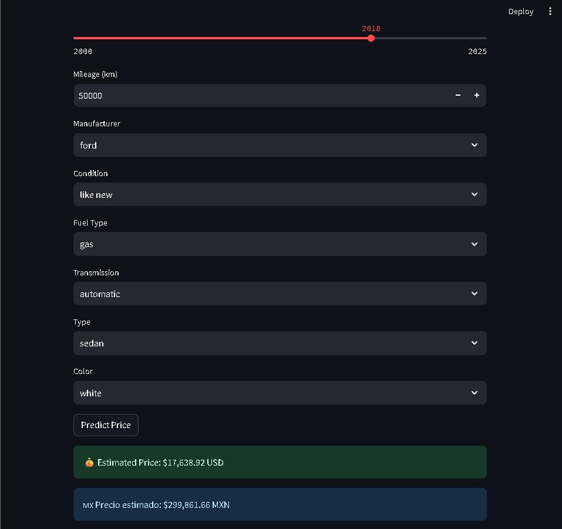
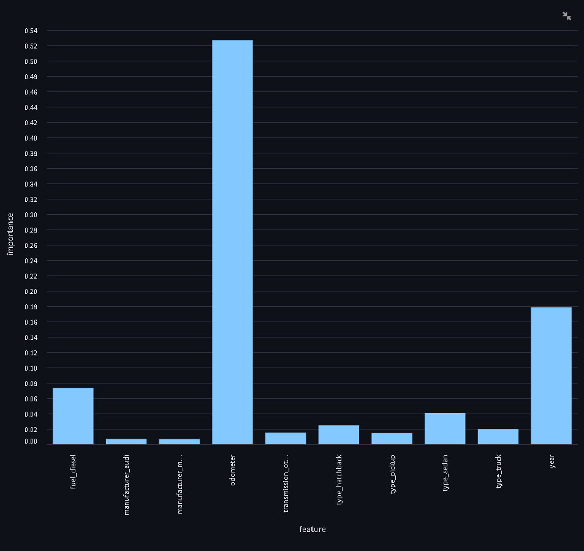
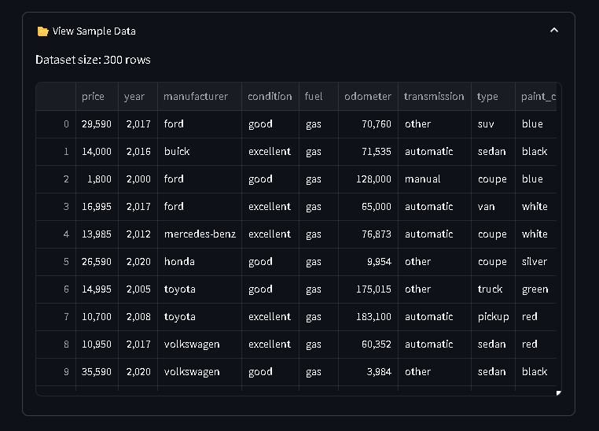

# Vehicle Price AI

This project was developed to analyze how different variables influence used vehicle prices and how effectively they can be modeled using machine learning in a real-world scenario.

It covers the full pipeline from data analysis to a deployed model using Streamlit.

**Live Demo:** https://vehicle-price-ai.onrender.com  
**Repository:** https://github.com/camargoluisenrique/vehicle-price-ai  

---

## Project Approach

Más que solo entrenar un modelo, el objetivo fue construir un flujo completo:

- entender el dataset (EDA)
- identificar variables relevantes
- comparar modelos
- validar resultados
- desplegar una versión funcional accesible

El foco estuvo en balancear simplicidad, interpretabilidad y desempeño.
---

## Key Features

- Real-time price prediction  
- Model performance metrics (MAE, RMSE)  
- Feature importance visualization  
- Dataset preview  
- Deployment on Render  
- USD → MXN conversion    

---

## Model Performance

Model evaluated on test dataset:

| Metric | Value |
|------|------|
| MAE | 3,549 |
| RMSE | 5,375 |

---

## Application (real usage)

Real screenshots from the deployed application:









---

## Modeling Process

The workflow followed in this project:

1. Data cleaning and filtering
2. Exploratory Data Analysis (EDA)
3. Feature engineering
4. Encoding categorical variables
5. Model training (Random Forest)
6. Evaluation using MAE and RMSE
7. Deployment with Streamlit

---

##  Dataset

- Source: Kaggle (used vehicles dataset)
- Cleaned dataset: `clean_data.csv`
- Sample dataset: `sample_data.csv` (for lightweight UI preview)

---


## Results

Se obtuvo un modelo capaz de estimar precios con un error razonable para este tipo de dataset.

Más importante que la métrica final, este proyecto me permitió entender:

- qué variables realmente aportan valor
- cómo se comportan distintos modelos
- dónde aparecen problemas como overfitting

---

## Challenges

- Overfitting en modelos más complejos
- Variables categóricas con alta cardinalidad
- Ruido en el dataset

## Future Improvements

- Feature engineering más profundo
- Probar modelos como XGBoost o LightGBM
- Mejor validación del modelo

---

## Key Learnings

- Simpler models can perform competitively with proper preprocessing  
- Feature selection has a strong impact on performance  
- Real-world datasets introduce noise that affects predictions

---

##  Tech Stack

- Python
- Pandas / NumPy
- Scikit-learn
- Streamlit
- Docker
- Render (deployment)

---

##  Run Locally

```bash
git clone https://github.com/camargoluisenrique/vehicle-price-ai.git
cd vehicle-price-ai

python -m venv venv
venv\Scripts\activate

pip install -r requirements.txt

streamlit run app.py
```

---

 Author

Luis Enrique Camargo  
Data Scientist | Applied Machine Learning | Python
